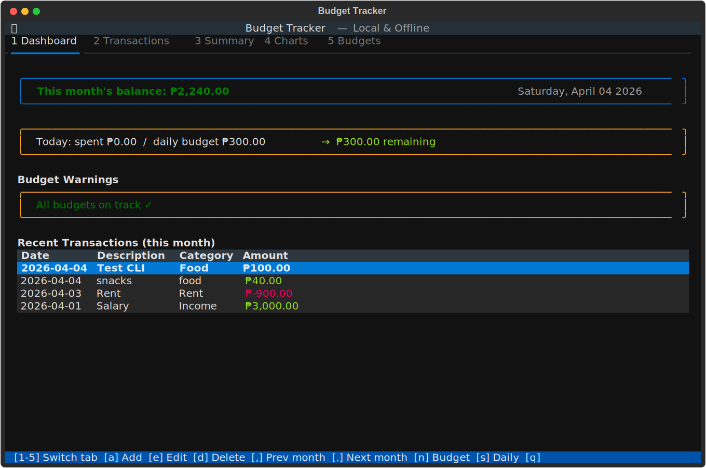
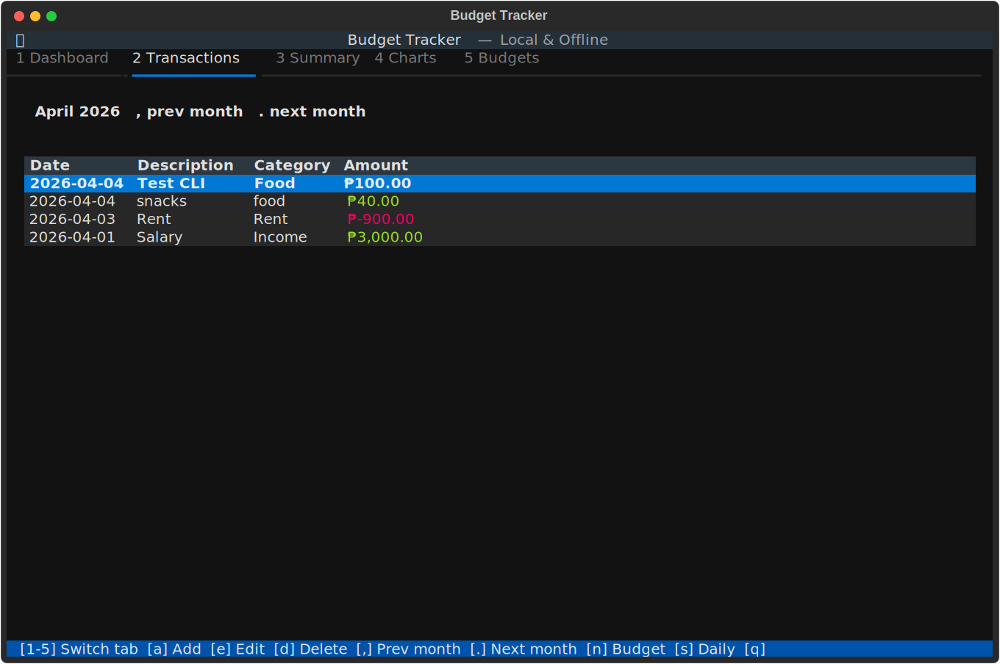
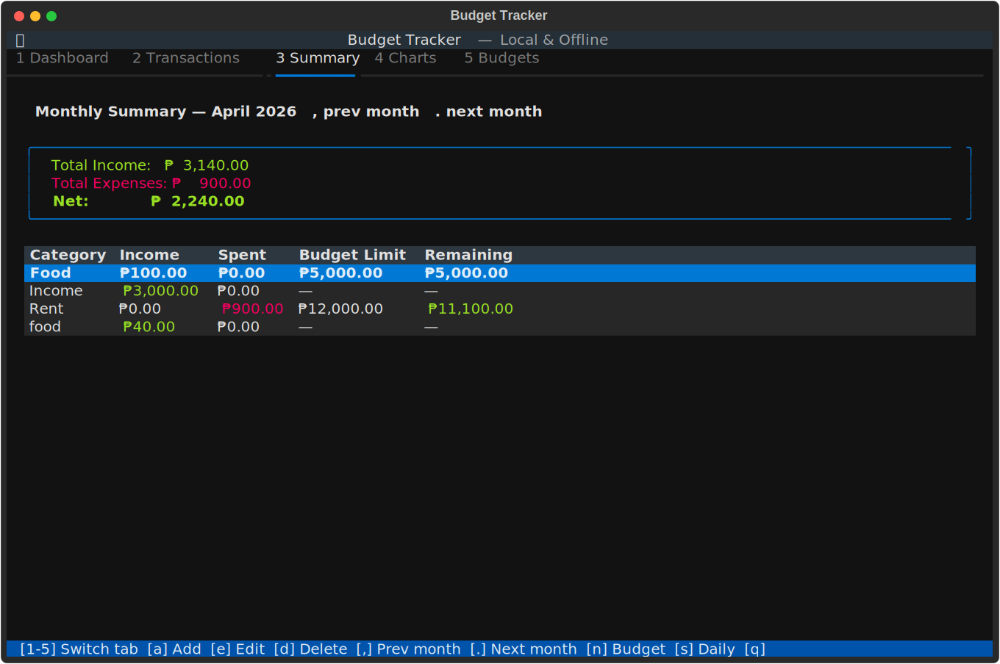
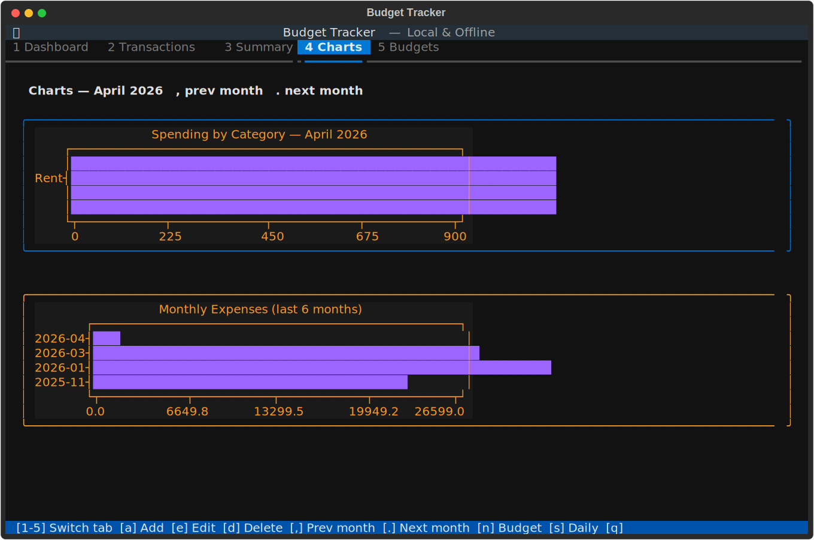
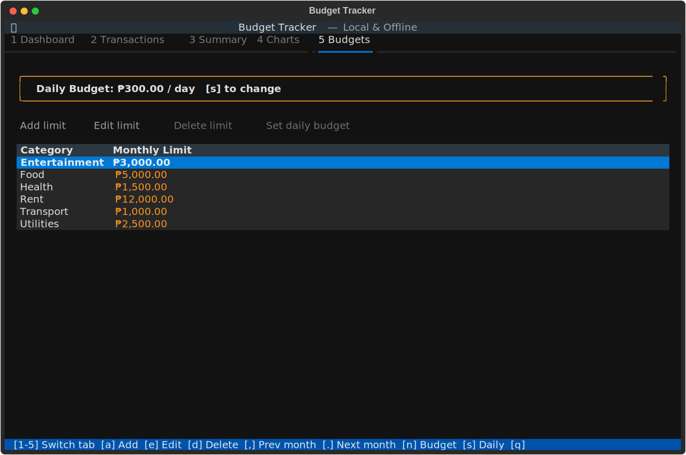
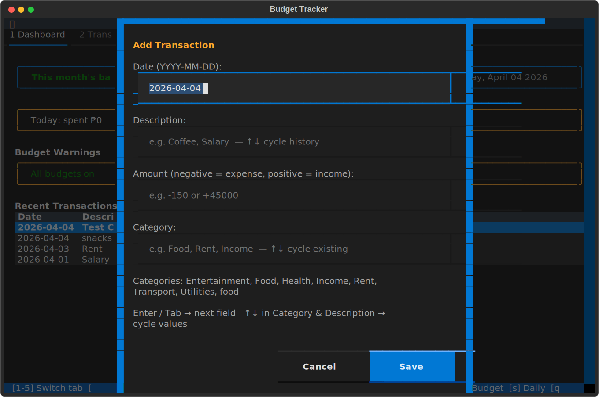

# Budget Tracker

A local, offline terminal budget tracker built with Python and Textual.

All data is stored in `~/.budget_tracker.db` (SQLite) — nothing leaves your machine.

## Screenshots

### Dashboard


### Transactions


### Monthly Summary


### Charts


### Budgets


### Add Transaction


## Setup

```bash
python3 -m venv venv
venv/bin/pip install -r requirements.txt
```

## Running

```bash
venv/bin/python main.py
```

Or if you've added the alias to `~/.zshrc`:

```bash
budget
```

## Controls

The controls bar at the bottom shows all available keys at a glance.

| Key | Action |
|-----|--------|
| `1`–`5` | Switch tabs |
| `a` | Add transaction (any screen) |
| `e` | Edit selected row |
| `d` | Delete selected row |
| `,` | Previous month |
| `.` | Next month |
| `n` | Add budget limit (Budgets tab) |
| `s` | Set daily budget (Budgets tab) |
| `q` | Quit |

### In forms
| Key | Action |
|-----|--------|
| `Enter` | Advance to next field |
| `Tab` / `Shift+Tab` | Move between fields |
| `↑` / `↓` | Cycle through existing values (Category & Description fields) |
| `Esc` | Cancel / close |

## Screens

**Dashboard** — current month balance, today's spending vs daily budget, budget warnings, and your 10 most recent transactions.

**Transactions** — full transaction list for the selected month. Use `,` and `.` to navigate months, `e` to edit, `d` to delete, `Enter` on a row to edit.

**Monthly Summary** — income, spending, and budget limits broken down by category with a net total.

**Charts** — spending by category (current month) and expenses over the last 6 months.

**Budgets** — set monthly spending limits per category (`n` to add, `e` to edit, `d` to delete) and a daily spending limit (`s`).

## Transactions

- **Positive amounts** are income (e.g. `45000` for salary)
- **Negative amounts** are expenses (e.g. `-150` for coffee)
- Categories are free-form — type anything, or use `↑`/`↓` to cycle existing ones

## Quick add from terminal

```bash
budget add <description> <amount> [category]
```

```bash
budget add Rent -12000 Rent
budget add Salary +45000 Income
budget add Coffee -150 Food
```
